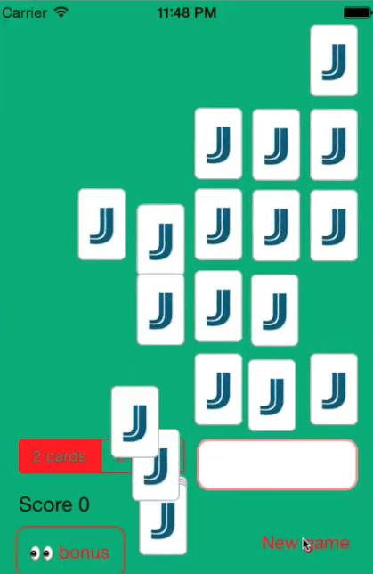
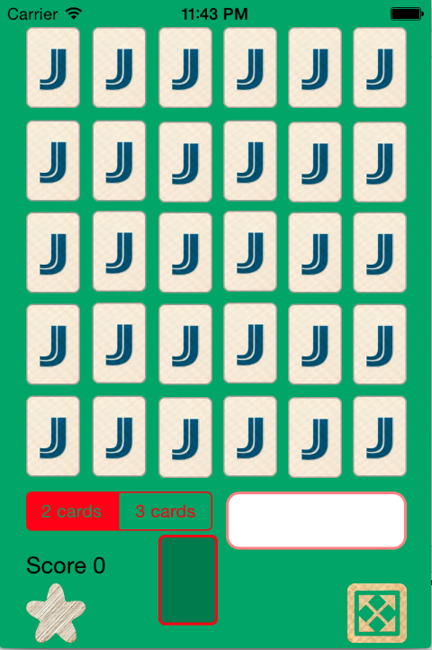

[toc]

New features and update to new new iPhone screens: sept 2017
Initial development year: 2015.

## iOS - Jeu de carte type Memory

Demo of a card matching game for iOS featuring *animations*, *sounds*, tricks... all that in Objective-C.
Development started for with compatible with iOS 7.0.

A screenshot of the process of dealing the cards.

Several UI elements were built or configured using only code, so that people can learn from it:

- The UI of the deck of cards: 

  The cards were programmatically stacked. This allows easy customization of things like the spacing between cards, the position/the size of the cards and deck.

- Rounded corners for cards and buttons:

  The pictures used for the cards do not have rounded corners. Rounded corners were added programmatically, along with the .
  *Why (not using image files that were already prepared) ?*

  - It's a choice one has to make. Sometimes you want your designer to do all the customization so that you, as a developer, can focus solely on the code and not worry about consistency between platforms (Android/iOS) among other things.
  - In this case, the app is specific to iOS and I did not provide my PSD files in this repo. And I want to showcase how one can customize a UI programmatically.

**Animations et sounds**

Animations have been added to make the UX closer to how one would experience a card matching game in real life (dealing, shuffling, ...)

- Shuffling the cards:

  [Animation] Making the cards look like they are picked up from the table and shuffled into the deck. IRL (In real life) picking up cards at the end of a game is done quickly, hence the adjusted speed to make it look real.
  Cards are visually assembled to form a deck.
  
  [Sound] 1 sound file of a shuffling is used and the sound is fine-tuned to be played with the animation (tuning the speed for picking up cards, the length of the whole sound effect must match the shuffling animation, the delay before the sound starts to play, ...).
  Some sound files may have blanks/mute audio at the beginning or the end).
  The file I used is a publicly available audio file of a deck being shuffled. This shows how a developer can adapt the UI and to a sound file (even when using public resources).

  *Technical Note* about the shuffling:
  
  - One might want to shuffle cards from the board into the deck by picking them in a random order. However, this raises a technical issue that cannot be addressed (at least not in a clean way).
  TLDR: doing would introduce an issue where cards would move under other cards.. the view hierarchy cannot be changed during the animation.
  Basically, the mean iOS uses to manage which views are on top of which view is called *the view hierarchy*. And in the case of a game of cards, it creates issues that can't be addressed.

- Dealing cards:

  [Animation] Cards are drawn from the deck and dealt on the board.

  [Sound] This time, 1 sound file is played for each card being dealt. [I wanted to show both approaches for sound files].
  The sound in the file is short (~1 second) and its speed rate has been adjusted to match the time a card takes to be dealt onto the board.

Game board

Dealing the cards:

 

Video example of a game. (*Note: the issue with cards sliding under set cards has been solved, but the video is not up to date*)

Compatibility: iOS 6 and newer versions

Tags: *iOS*, *Objective-C*, *ARC*
